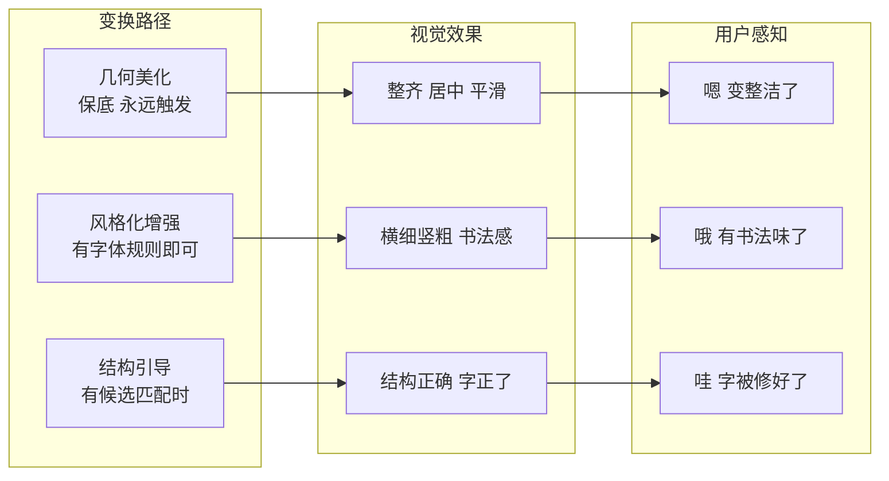

# 笔迹变换方案设计——笔迹到底怎么变

> 视觉反馈只是包装，**笔迹本身的变换**才是重绘功能的核心价值。
> Apple 的做法：识别准确率够高 → 直接替换为字体（大胆、昂贵）
> 我们的做法：**在不识别的条件下，让笔迹自己变好看**（安全、免费、永远有效）

---

## 核心原则

```
┌─────────────────────────────────────────────┐
│  不增加笔画，不删除笔画                      │
│  不改变拓扑结构（闭环数、交叉点不变）        │
│  不改变笔画顺序                             │
│  但可以让每一笔都变得更"讲究"               │
└─────────────────────────────────────────────┘
```

**Apple 替换字体** ↔ **我们美化笔迹** 的差异本质：

| 维度 | Apple（识别+替换） | 我们（美化+引导） |
|------|-------------------|------------------|
| 准确率依赖 | 必须 90%+ | 0% 也能工作 |
| 结果形态 | 字体渲染（完美但冰冷） | 手写美化（温暖有灵魂） |
| 用户感知 | "被替换了" | "被优化了" |
| 失败代价 | 完全错字 | 至少变好看了 |
| 保留个性 | 不保留 | 保留笔触和风格 |

---

## 三条变换路径

根据"我们知道多少"，分三个层级，**每一层都有可视效果**：


---

## 第1层：几何美化（Smooth & Align）

**这是什么**：纯几何运算，不需要知道字是什么，也不需要字体。

**已有资产**：[`StrokeBeautifyEngine.ts`](src/core/beautify/StrokeBeautifyEngine.ts) 中的 `beautifyStroke()` + [`CharacterClusterEngine.ts`](src/core/beautify/CharacterClusterEngine.ts) 中的 `optimizeClusters()`

### 具体变换

| 变换 | 算法 | 效果 |
|------|------|------|
| **锯齿平滑** | 自适应 curvature-aware smoothing | 手抖造成的锯齿消失 |
| **微弯拉直** | R² > 0.96 的段投影到直线 | 该直的笔画变直 |
| **圆角处理** | 拐角处曲率 > 0.55 的做 Bezier 圆角 | 转折不突兀 |
| **宽高比归一化** | 以字形中心为原点缩放 | "口"不再是扁的或长的 |
| **居中对齐** | 笔画质心移到包围盒几何中心 | 字不歪 |

### 视觉变化（用户看到什么）

```
原始:  ┌─┐    (锯齿边缘，略歪)
       │/│
       └─┘

美化后: ┌─┐    (边缘平滑，方正，居中)
        │ │
        └─┘
```

**这是保底层**——永远触发，永远有效。

---

## 第2层：风格化增强（Stylize）

**这是什么**：应用字体风格规则（正楷、行书、草书、圆体），让笔迹具有书法特征。

**已有资产**：[`FontStyleSystem.ts`](src/core/beautify/FontStyleSystem.ts) 中的 `generateTargetStrokes()` + [`StrokeBeautifyEngine.ts`](src/core/beautify/StrokeBeautifyEngine.ts) 中的 `aggressiveBeautifyStroke()`

### 具体变换

| 变换 | 算法 | 效果 |
|------|------|------|
| **方向量化** | 段方向吸附到 4/8 方向 | 楷书横平竖直，行书流动 |
| **横细竖粗** | 水平段宽度×0.65，垂直段×1.35 | 正楷招牌特征 |
| **书法 taper** | 笔画两端收尖 | 毛笔书写感 |
| **PCA 对齐** | 主成分分析后对齐到最近轴 | 整体不歪 |

### 视觉变化（用户看到什么）

```
美化后: ┌─┐     风格化后(楷书): ┌─┐
        │ │     横细竖粗        │ │   ← 竖画更粗
        └─┘                     └─┘     ← 收笔尖
```

**这层不需要识别**——只要用户选择了某种字体风格，规则就直接应用。

---

## 第3层：结构引导（Structure Guide）

**这是什么**：当我们有一个"猜测"（即使置信度不高），用该字的模板来引导笔画结构调整。

**已有资产**：[`StrokeTemplateEngine.ts`](src/core/beautify/StrokeTemplateEngine.ts) 中的 `getTemplate()` + `computeCorrections()`

### 与"识别替换"的本质区别

| | 识别替换（旧） | 结构引导（新） |
|--|--------------|--------------|
| 需要确认识别 | ✅ 必须知道是什么字 | ❌ 只需要一个候选 |
| 替换方式 | 完全替换为字体渲染 | 拉拽笔画到正确位置 |
| 保留笔触 | ❌ 消失 | ✅ 保留 |
| 置信度要求 | > 0.6 | > 0.15 即可 |
| 错误代价 | 完全错字 | 轻微位置偏移 |

### 具体变换

```
用户写"田" 但写成了：
  ┌───┐
  │   │    中间十字偏右
  └───┘

模板"田"的笔画位置：
  左上竖 → x:0.2   右上竖 → x:0.8
  上横 → y:0.2     下横 → y:0.8

修正（强度 = 置信度 × 0.6）：
  中间十字 → 向左移动 (目标x0.5 - 当前x0.6) × 0.6
  结果：十字移到更接近中间的位置
```

### 关键机制：置信度映射到修正强度

```typescript
function computeCorrectionStrength(confidence: number): number {
  // confidence 0.15 → strength 0.2 (轻微引导)
  // confidence 0.40 → strength 0.5 (中等修正)
  // confidence 0.60 → strength 0.8 (强力修正)
  // confidence >0.8 → strength 1.0 (几乎完全对齐)
  const clamped = Math.max(0.15, Math.min(1.0, confidence));
  return (clamped - 0.15) / 0.85; // 0..1 映射
}
```

**永远不要完全对齐**——保留用户的书写痕迹。

---

## 三路径对比总结



**用户至少感受到 P1，可能感受到 P2，偶尔感受到 P3。**  
但 P1 + P2 已经覆盖了 90% 的书写体验。

---

## 与 OrganicAnimationEngine 的结合

每一层的变换结果都作为"目标姿态"输入到 [`OrganicAnimationEngine.ts`](src/core/beautify/OrganicAnimationEngine.ts)：

```
笔画写完
  │
  ├─→ 立即：呼吸动画（微抖动，作为"等待"状态）
  │
  ├─→ 800ms 后：触发重绘
  │     ├─ 第1层目标：beautifyStroke + optimizeClusters
  │     ├─ 第2层目标：aggressiveBeautifyStroke (风格化)
  │     └─ 第3层目标：template corrections (如果有)
  │
  └─→ OrganicAnimationEngine 从当前位置 → 目标位置 做蠕变动画
        ├─ 横画从左到右"长"过去
        ├─ 竖画从上到下"长"下来
        └─ 完成后 pulse 反馈
```

**整个过程对用户来说是连续的**：写完 → 呼吸 → 蠕动变形 → 脉冲完成。没有"等待→突然变化"的断裂感。

---

## 现有资产的复用程度

| 文件 | 第1层 | 第2层 | 第3层 | 说明 |
|------|-------|-------|-------|------|
| [`StrokeBeautifyEngine.ts`](src/core/beautify/StrokeBeautifyEngine.ts) | ✅ `beautifyStroke()` | ✅ `aggressiveBeautifyStroke()` | - | 直接复用 |
| [`CharacterClusterEngine.ts`](src/core/beautify/CharacterClusterEngine.ts) | ✅ `optimizeClusters()` | - | - | 直接复用 |
| [`FontStyleSystem.ts`](src/core/beautify/FontStyleSystem.ts) | - | ✅ `generateTargetStrokes()` | - | 直接复用 |
| [`StrokeTemplateEngine.ts`](src/core/beautify/StrokeTemplateEngine.ts) | - | - | ✅ `computeCorrections()` | 需要增强置信度映射 |
| [`OrganicAnimationEngine.ts`](src/core/beautify/OrganicAnimationEngine.ts) | ✅ | ✅ | ✅ | 需要改造为波传播 |
| [`RedrawOrchestrator.ts`](src/core/beautify/RedrawOrchestrator.ts) | ✅ | ✅ | ✅ | 需要重构为多路径 |

**已有代码可复用率：~85%** ——主要工作是"重新连线"而非"重新发明"。

---

## 跟之前方案的区别

| 方案 | 思路 | 问题 |
|------|------|------|
| 结构化拓扑匹配 | 提取闭环/交叉点等特征做精确过滤 | 如果没有匹配，什么都做不了 |
| 集成式多通道投票 | 多个弱分类器投票提高准确率 | 投票结果仍然只有"对"或"错" |
| **本方案（体验优先）** | 不依赖识别，分层美化 | ✅ 永远不会失败，总有反馈 |

**本方案不是对前两个方案的替代，而是对它们的重新定位**：
- 拓扑匹配和投票法的结果作为 **第3层的置信度输入**
- 即使它们都失败了（置信度=0），第1层和第2层仍然工作
- 它们不再是"唯一路径"，而是"可选增强"
