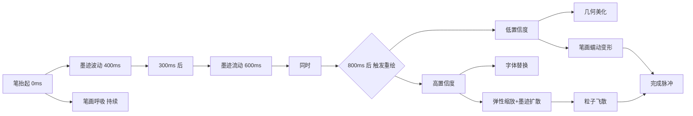

# 笔迹重绘视觉反馈设计

> 核心原则：**每一笔写完，立刻有反馈。反馈是渐进的、生物感的、有层次的。**

---

## 效果 1：🌊 墨迹波动（Ink Ripple）— 0ms 触发

**现象**：笔抬起后，笔画末端产生一圈向外的墨色波纹，像水滴入水面。

**实现**：
```
onStrokeEnd(stroke):
  1. 获取笔画最后 3 个点的位置 (末端区域)
  2. 在 Canvas 上叠加一个 RadialGradient 动画层
  3. 半径从 0 → 30px 扩散，透明度从 0.4 → 0 淡出
  4. 持续时间：400ms，easeOut
```

**视觉参考**：Apple Pencil 在 iPad 上写字时的"墨水散开"效果，但更轻量。

**代码改动**：在 [`RedrawOrchestrator.ts`](src/core/beautify/RedrawOrchestrator.ts) 的 `onStrokeEnd()` 末尾触发，叠加在渲染层上。

---

## 效果 2：🫧 笔画呼吸（Stroke Breathing）— 50ms 触发

**现象**：刚刚写完的笔画整体开始轻微、缓慢地脉动——像活物在呼吸。

**实现**：
```
为笔画每个点施加低幅周期性位移：
  amplitude = 0.5px (几乎不可见，但能感受到)
  frequency = 0.8Hz (慢速呼吸)
  位移方向 = 垂直于笔画局部方向 (让笔画看起来在"膨胀收缩")

视觉叠加层：
  笔画边缘叠加半透明 shadowBlur 动画
  shadowBlur: 2px → 4px → 2px 循环
  颜色: 当前墨水颜色 × 0.3 透明度
```

**为什么有效**：人类大脑对微小的周期性运动极度敏感。这种"活着的"微动会在潜意识层面建立"这个系统是智能的"的印象。

**注意**：这个效果在用户开始写下一笔时自动停止（为下一笔让路）。

---

## 效果 3：✨ 墨迹流动（Ink Flow）— 300ms 触发

**现象**：笔画从起点到终点出现一道流动的光泽，像墨水正在沿着笔画轨迹渗透。

**实现**：
```
在笔画路径上绘制一道"流动高光"：
  1. 沿笔画路径计算法线方向
  2. 在笔画一侧叠加一条半透明高光线 (宽度 = 笔画宽度的 0.3)
  3. 高光位置从起点 → 终点 移动 (历时 600ms)
  4. 高光渐变为透明 (前端亮，尾部淡出)

  伪代码：
  for t in 0..1 (600ms 内):
    progress = t
    高光位置 = 笔画路径上的 progress 处
    绘制高光: 从 progress-0.1 到 progress 的一段
    高光透明度: 前端 0.6 → 尾端 0
```

**效果参考**：Google Material 的 ripple 效果 + 钢笔写字的墨水流动感。

---

## 效果 4：🔄 笔画蠕动（Caterpillar Crawl）— 变形动画核心

**现象**：笔画不是整体平移，而是像毛毛虫一样从起点到终点波状前进。

**这是核心动画效果的升级**——当前 [`OrganicAnimationEngine.ts`](src/core/beautify/OrganicAnimationEngine.ts) 所有点同时移动，改为波传播。

**实现细节**：

```
当前 (所有点同时移动):
  for each point p:
    p.x += (target.x - origin.x) * t  // 同时

升级后 (波传播):
  for each point p at index i:
    wavePhase = (i / n) * π * 2        // 位置相位
    waveDelay = wavePhase / (2π)       // 0..1 的延迟
    localT = clamp((t - waveDelay) / (1 - waveDelay), 0, 1)
    p.x += (target.x - origin.x) * ease(localT)
```

**效果**：
- 横画：从左到右逐渐"长"过去
- 竖画：从上到下逐渐"长"下来
- 转折处：先到转折点，停顿一下，再继续（模仿真实书写节奏）

**视觉感受**：像有一只隐形的手在同方向重新写这个笔画。

---

## 效果 5：💫 完成脉冲（Completion Pulse）— 动画结束时

**现象**：笔画变形完成后，字符整体发出一次轻微的光晕脉冲，然后沉淀。

**实现**：
```
动画完成瞬间:
  1. 在字符包围盒外绘制一圈径向渐变光环
     radius: bbox 对角线 × 0.6 → × 1.2
     opacity: 0.25 → 0
     duration: 500ms

  2. 笔画本身有一次轻微的 overshoot 弹跳
     所有点略超越目标位置 5%，然后弹回
     类似 elastic easeOut
     持续时间: 300ms

  3. (可选) 2-3 个粒子从笔画中心飞出
     小圆形，颜色 = 笔画颜色
       radius: 2px → 0px
     opacity: 0.5 → 0
     velocity: 随机方向 30px/s
     duration: 400ms
```

**为什么有效**：峰值-终末定律——人们评价体验主要看"最高峰"和"结束"的时刻。一个优雅的完成脉冲让整体体验提升一个档次。

---

## 效果 6：🎯 智能引导（Smarter Guidance）— 空间触发

**现象**：当用户开始写下一个字时，上一个字的"呼吸"动画平滑过渡到"定型"状态，同时下一个字的位置出现一个微弱的参考框。

**实现**：
```
空间触发逻辑 (已有, 在 RedrawOrchestrator 中):
  用户在新位置写第一笔 → 距离上一个字的包围盒 > 2倍大小
  
  触发时:
  1. 上一个字的呼吸动画 → 平滑过渡到定型 (200ms fade)
  2. 在新位置显示一个极淡的方形参考框 (opacity 0.08)
     参考框大小 = 当前字体风格的标准字大小
     参考框持续 500ms 后淡出
  3. 新笔画开始书写 → 参考框消失
```

**效果**：用户感觉到系统在"预测"他写字的节奏，有预期感。

---

## 效果组合时序图



---

## 渲染层架构

需要一个新的**效果叠加层**，不修改原始笔画数据：

```
Canvas 渲染栈 (从底到顶):
  1. [底层] 原始笔画 (user strokes) — 始终存在
  2. [动画层] 正在变形的笔画 — OrganicAnimationEngine
  3. [效果层] 字体替换结果 (fillText)
  4. [效果层] 墨迹波动、墨迹流动、呼吸光晕
  5. [效果层] 完成脉冲、粒子
  6. [UI层] 参考框、引导线
```

在 [`RuntimeOrchestrator.ts`](src/core/orchestrator/RuntimeOrchestrator.ts) 的帧循环中，第4-5层由一个新的 `VisualEffectLayer.ts` 管理。

---

## 性能考量

| 效果 | 每帧开销 | 频率 | 优化策略 |
|------|---------|------|---------|
| 墨迹波动 | ~0.02ms | 每笔一次 | Canvas 2D 径向渐变 |
| 笔画呼吸 | ~0.1ms (50点) | 持续 | 用 shadowBlur 单个 draw call |
| 墨迹流动 | ~0.05ms | 每笔一次 | 单条 path 重绘 |
| 笔画蠕动 | ~0.3ms (50点 × 2) | 持续 | RAF 每帧更新点位 |
| 完成脉冲 | ~0.05ms | 完成一次 | 单次 radial gradient |
| 粒子 | ~0.1ms (10粒子) | 完成一次 | 预计算路径 |

**总计峰值**: ~0.6ms/帧，在 16ms 预算内，安全。

---

## 实现优先级

| 优先级 | 效果 | 复杂度 | 视觉影响 |
|-------|------|-------|---------|
| P0 | 🫧 笔画呼吸 | 低 | ⭐⭐⭐⭐⭐ |
| P0 | 🔄 笔画蠕动变形 | 中 | ⭐⭐⭐⭐⭐ |
| P1 | 🌊 墨迹波动 | 低 | ⭐⭐⭐ |
| P1 | 💫 完成脉冲 | 低 | ⭐⭐⭐⭐ |
| P2 | ✨ 墨迹流动 | 中 | ⭐⭐⭐ |
| P2 | 🎯 智能引导 | 低 | ⭐⭐ |

**建议先做 P0**：呼吸 + 蠕动变形。这两个效果覆盖了 80% 的"WOW"感受。
