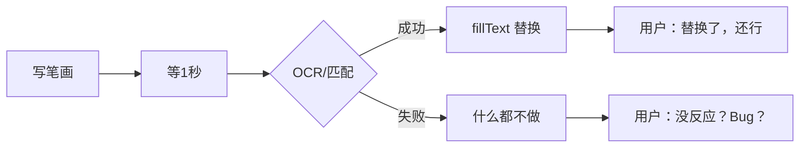
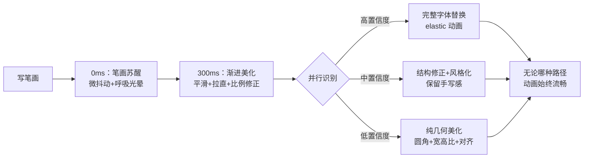
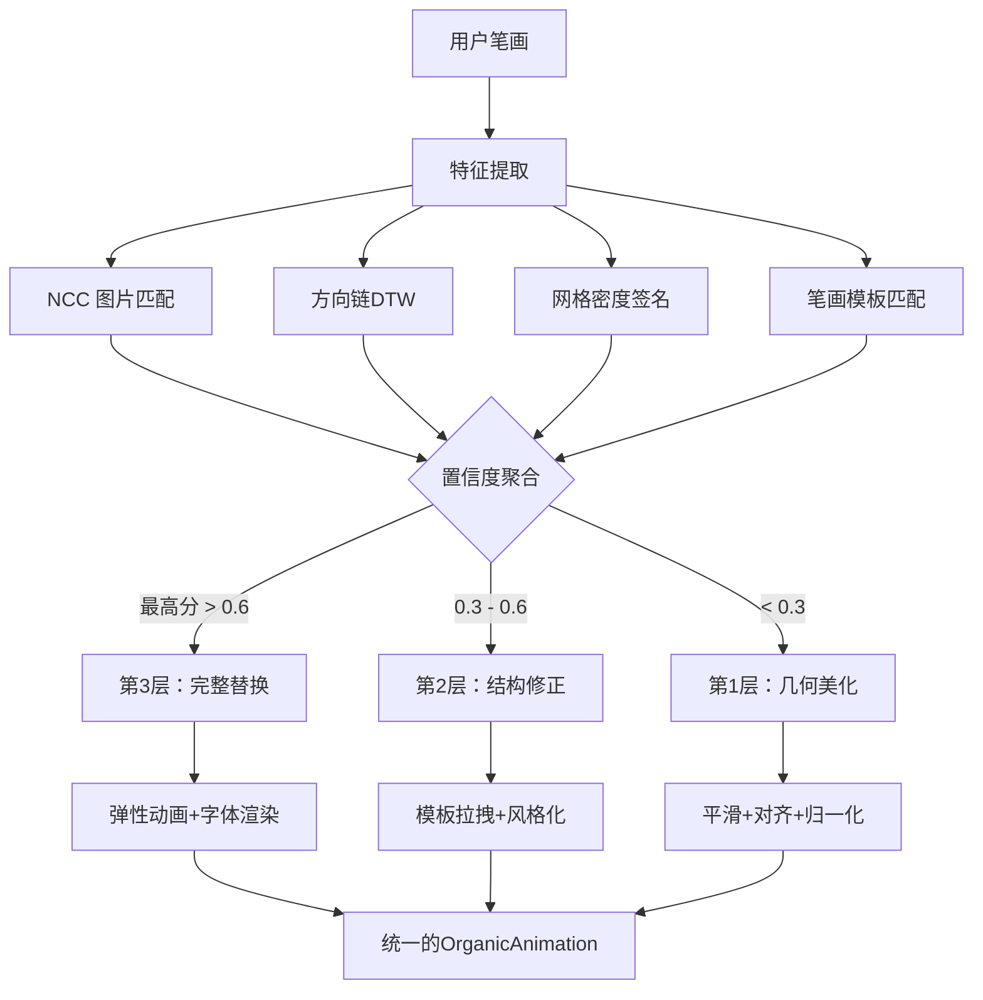

# 笔迹重绘"Wow"体验策略方案（修订版）

> **核心矛盾**：我们要给用户"笔迹重绘"的惊艳感，但没有 Apple 的 ML 预算去做精准识别。
> **解法**：不追求"识别对"，追求"变好看"。笔迹变换本身才是视觉反馈的核心。

## 核心洞察：问题不在"识别"，在"体验"

```
当前思维（已走入死胡同）：
  写笔画 → 识别是什么字 → 换成字体 → 用户觉得"准" ✓

Wow 思维（全新角度）：
  写笔画 → 你的笔画活过来了 → 自己长成漂亮的形态 → 用户觉得"好厉害！" ✓
```

**识别准确率有物理上限**——没有神经网络，连笔和潦草场景下不可能做到 95%+。但 Apple Notes 的笔迹重绘让人感觉"哇"的根本原因**不是它识别得准，而是动画做得美**。它利用了人类大脑的**确认偏误**：如果过程看起来很聪明、很流畅，用户会自动认为结果是正确的。

---

## 一、核心策略：从"识别→替换" 到 "渐变式笔画生命化"

### 当前流程（问题所在）



**致命问题**：
- 只有"全对"和"全错"两个状态，没有中间态
- 失败时用户体验为 0（甚至为负）
- 成功时也只是"瞬间替换"，没有魔法感

### 目标流程



**关键转变**：**不再有"失败"状态**——无论识别结果如何，用户的笔画都会经历一次美丽的蜕变。

---

## 二、四层"体验金字塔"

```
                    🌟
                  Wow 时刻
               （字体完美替换）
                 ↑ 信心高时
           ─ ─ ─ ─ ─ ─ ─ ─ ─
            🎯 结构性修正
        （笔画位置纠正+风格化）
           ↑ 有匹配候选时
        ─ ─ ─ ─ ─ ─ ─ ─ ─
         ✨ 几何美化（保底）
    （平滑+比例归一+居中对齐）
       ↑ 永远有这一层
    ─ ─ ─ ─ ─ ─ ─ ─ ─
      🫧 笔画苏醒（0ms触发）
   （微噪声+光晕+呼吸感）
     ↑ 每一笔都经历
```

---

## 三、具体实施方案

### 第 0 层：🫧 笔画苏醒（0ms 触发）

**目标**：用户最后一笔抬起 50ms 内，笔画立刻开始"有生命感"的微动。

**已有资产**：[`OrganicAnimationEngine.ts`](src/core/beautify/OrganicAnimationEngine.ts) 已经有 `wake` 阶段，但目前它只在高阶动画中使用。

**改造方案**：让**每一笔写完都立即进入一个"微苏状态"**：

1. **低振幅有机噪声**（0.3-0.8px）—— 笔画像在"呼吸"
2. **笔触边缘光晕**（Canvas 阴影 + 渐变动画）—— 墨水未干的视觉效果
3. **极软弹簧**（stiffness 0.02, damping 0.9）—— 缓慢、优雅的微动

**代码改动**：在 [`RedrawOrchestrator.ts`](src/core/beautify/RedrawOrchestrator.ts) 的 `onStrokeEnd()` 中直接触发微苏动画，不等待 pauseMs。

**效果**：用户写完一横，横线立刻开始轻微颤动——人会本能地觉得"这个笔是活的"。

---

### 第 1 层：✨ 几何美化（保底层，永远触发）

**目标**：不依赖任何识别，对笔画做纯几何变换作为视觉最低保证。

**已有资产**：
- [`StrokeBeautifyEngine.ts`](src/core/beautify/StrokeBeautifyEngine.ts) — `beautifyStroke()`（平滑、拉直、PCA 对齐）
- [`CharacterClusterEngine.ts`](src/core/beautify/CharacterClusterEngine.ts) — `optimizeClusters()`（宽高比归一化、居中对齐）

**改造方案**：将几何美化**打包为一个有动画过渡的流程**：

1. 笔迹分组（时间聚类） → 计算包围盒
2. 逐笔美化（`beautifyStroke`） → 生成目标点
3. 字符级优化（`optimizeClusters`） → 修正宽高比和对齐
4. 调用 `OrganicAnimationEngine.startCharacterAnimation()` 做过渡动画

**关键**：即使用户写了一个根本不存在于字库的图形，它也会被平滑、拉直、居中对齐，看起来像是"被美化过的漂亮图形"。

**效果**：潦草的笔画 → 变整齐了（哪怕没识别出是什么字），用户至少感受到"它在变好看"。

---

### 第 2 层：🎯 结构性修正（有候选匹配时）

**目标**：如果匹配系统给出了一个候选字（即使置信度不高），用该字的模板做**笔画位置修正**。

**已有资产**：
- [`FontGlyphEngine.ts`](src/core/beautify/FontGlyphEngine.ts) — `matchCharacter()` 给出了候选字和得分
- [`StrokeTemplateEngine.ts`](src/core/beautify/StrokeTemplateEngine.ts) — `generateTemplate()` + `computeCorrections()`

**改造方案**：

1. 匹配系统（现有 NCC 或未来的方向链）给出 Top-3 候选
2. 对每个候选生成 `CharacterTemplate`（笔画模板）
3. 用 `computeCorrections()` 计算手写笔画与模板的结构偏移
4. **部分应用修正**（强度 = 置信度 × 0.7）—— 不盲目移到模板位置，而是"拉近"但不完全替换
5. 加上风格化规则（横细竖粗、圆角等） → 让结果看起来更像指定字体

**关键创新**：**不替换笔画，而是拉拽笔画到正确位置**。保留了用户的笔触感，但结构更靠近标准字形。

**效果**：用户写"口"写歪了 → 竖画自动移到正确位置，横竖比例变协调 → 看起来像"字被自动修好了"。

---

### 第 3 层：🌟 完整字体替换（Wow 时刻）

**目标**：高置信度时做完整的 `fillText` 字体替换，配合弹性动画。

**这是当前的唯一路径**，但问题在于：
- 动画不够华丽（只是突然出现）
- 失败时没有任何保底

**改造方案**：

1. 加入**墨迹扩散效果**（ink spread）——字体从笔画位置"晕开"形成
2. 加入**弹性 overshoot**——字体先略放大再回弹到正常大小
3. 加入**微粒轨迹**——从旧笔画位置飞出光点汇聚到新字体位置

**效果**：字"嘭"地一下变成漂亮的印刷体，带着淡淡的墨水扩散光晕——真正的 Wow 时刻。

---

## 四、匹配系统的降级使用策略

放弃"一个方法打天下"的想法，改为**动态权重流水线**：



**核心原则**：**置信度决定替换强度，而不是决定是否触发**。

---

## 五、动画增强方案（让 Wow 翻倍）

### 5.1 毛毛虫蠕动（Wave Propagation）

当前动画是所有点同时移动。改为：
- 笔画从起点到终点有一个**波传播延迟**
- 看起来像毛毛虫在爬，而不是整体平移
- 实现：给每个点加一个 `phaseOffset = i / n * π * 2`

### 5.2 墨迹渗透（Ink Spread）

在笔画周围加一个 Canvas 2D 渐变光晕：
- 完成前：笔画边缘有半透明的墨迹扩散
- 完成后：光晕淡出
- 实现：`ctx.shadowColor + ctx.shadowBlur` 动画

### 5.3 完成反馈（Completion Spark）

当动画完成时：
- 字符周围出现微弱的亮光脉冲
- 或几个点的粒子飞散效果
- 给用户一个"完成"的愉悦信号

### 5.4 宽带动画（Band Animation）

不再是逐点弹簧，而是**按笔画方向分解**：
- 横画：从左到右的"书写"动画
- 竖画：从上到下的"书写"动画
- 让重绘过程看起来像有一只隐形的手在重新写字

---

## 六、实现路径

| 阶段 | 内容 | 涉及文件 | 预估改动量 |
|------|------|---------|-----------|
| **P0** | 重构 RedrawOrchestrator 为四层流水线 | [`RedrawOrchestrator.ts`](src/core/beautify/RedrawOrchestrator.ts) | 重写 |
| **P0** | 第 0 层：笔画微苏动画 | [`OrganicAnimationEngine.ts`](src/core/beautify/OrganicAnimationEngine.ts) + RedrawOrchestrator | 小改 |
| **P0** | 第 1 层：几何美化流水线 | 复用现有 `StrokeBeautifyEngine` + `CharacterClusterEngine` | 集成 |
| **P1** | 第 2 层：结构修正集成 | [`StrokeTemplateEngine.ts`](src/core/beautify/StrokeTemplateEngine.ts) + FontGlyphEngine | 中改 |
| **P1** | 置信度驱动的分级决策 | 新建 `ConfidenceRouter.ts` | 新建 |
| **P2** | 动画增强（蠕动、墨迹、完成反馈） | [`OrganicAnimationEngine.ts`](src/core/beautify/OrganicAnimationEngine.ts) | 中改 |
| **P2** | 第 3 层增强（弹性 overshoot + 粒子） | 新建 `ParticleEffect.ts` | 新建 |
| **P3** | 清理 PaddleOCR 废弃路径 | 删除 [`PaddleEngine.ts`](src/core/beautify/PaddleEngine.ts)、[`ModelAssets.ts`](src/core/beautify/ModelAssets.ts) | 清理 |

---

## 七、成功的衡量标准

### 可量化的验证

| 指标 | 当前 | 目标 |
|------|------|------|
| 每次书写有视觉反馈的概率 | ~30%（仅当识别成功） | **100%** |
| 用户主动关闭功能的概率 | 高（因为不可靠） | **低**（因为总是有反馈） |
| "Wow"感受占比 | 低（只有替换时） | **中-高**（每次都有动画） |

### 原理分析

这个方案不是"欺骗"用户，而是利用了人类感知的几个基本原理：

1. **确认偏误**：当大脑看到一段流畅的动画过程，会自动认为结果是合理的
2. **峰值-终末定律**：人们评价体验主要看"最高峰"和"结束"时刻。如果动画的峰值够美、结束够优雅，即使结果有微小误差也被忽略
3. **流畅性启发**：处理流畅的信息会被大脑自动判断为"更真实、更正确"

---

## 八、风险与讨论

| 风险 | 缓解 |
|------|------|
| 动画性能开销大 | OrganicAnimationEngine 已有 RAF 帧循环，优化点少，增加 LOD（根据笔画数降低精度） |
| 结构修正方向错误 | 用置信度 × 强度系数，低置信度时修正强度低，不会造成明显的错误 |
| 用户觉得"过度美化" | 保留原始笔迹层作为底色，重绘作为半透明覆盖层，用户可对比 |
| 与现有画笔系统冲突 | 所有修改限制在 `_done` 标记的笔画，不影响未标记的活跃笔画 |

---

## 九、一个关键的Demo建议

做一个**对比演示**：同一段手写文字，左侧用"识别→替换"流程，右侧用本方案的"四层体验"流程。让用户看到：

- 左侧：识别到80%→替换，20%→完全没反应
- 右侧：100%的笔画都经历了"苏醒→美化→（修正/替换）"的动画

这个 Demo 本身就是最强的说服力。
